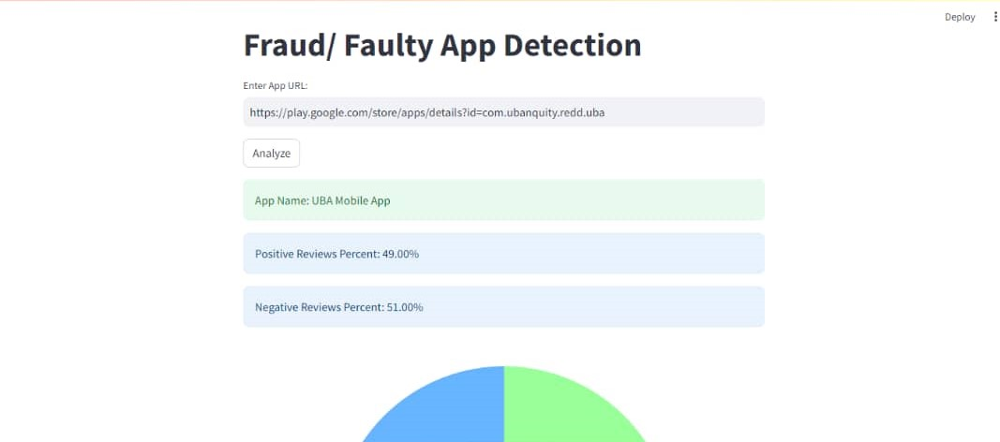
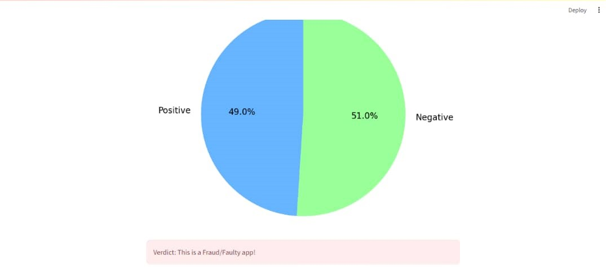
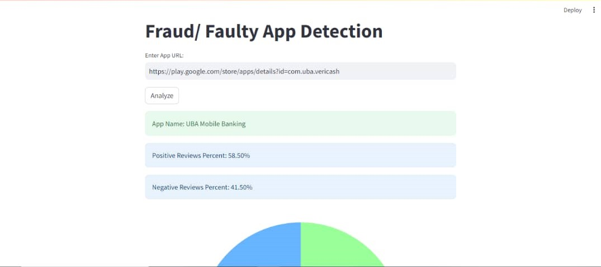
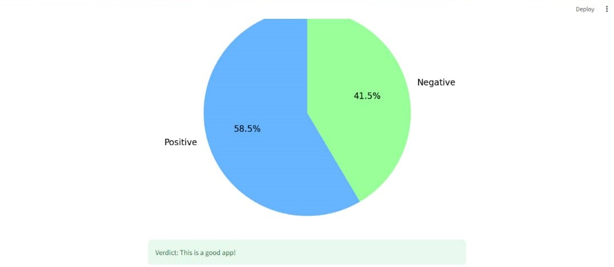

# Fraud-App-Detection-using-Sentiment-Analysis

This app collects a play store apps url and scrapes its review using sentiment analysis for reviews with bad words and reviews with good words and based on the reviews the score is calculated to determine if  an app is good or bad based on its reviews, i wanted the score to be visualized in a pie chart or so with a pie where score is less than or equal to 0.0085, it suggests a "Fraud Alert.", If the score is between 0.0085 and 0.012, it indicates that the content might not be very safe or has poor-quality features, If the score is greater than 0.012, it suggests that the content is "Safe to use." i dont rellay know something like this or a way to visualize the score variable counting the bad reviews and the good reviews and if the bad reviews are greater than the good reviews determines the app is fraudlent.

## Images
<!--Images-->

